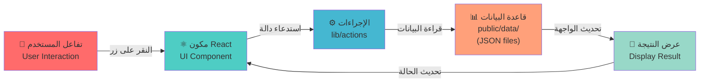

<div align="center">


# Zad 📖

**منصة تعليمية إسلامية شاملة بلا اتصال بالإنترنت — لتدبر القرآن، ودراسة الحديث، والاستماع للبودكاست، واستكشاف قصص الصحابة**

<p>
  
  
  
  
  
</p>

</div>

---

## 📱 حول المشروع

**Zad** هي منصة تعليمية إسلامية مفتوحة المصدر مصممة لتوفير بيئة تعليمية مركزة وخالية من المشتتات. تجمع بين مجموعة شاملة من الأدوات التعليمية:

- 📕 **قارئ القرآن الكريم** - مع التلاوة والتفسير
- 🕌 **مجموعات الحديث الشريف** - مع الشروحات العلمية
- 📚 **قصص الصحابة الكرام** - للتعلم من سيرتهم
- 🎙️ **مكتبة البودكاست الإسلامي** - مع النصوص والنقاط الرئيسية
- 🧪 **الاختبارات التفاعلية** - لقياس الفهم والاستيعاب
- 🌙 **دعم الوضع الليلي** - لراحة العينين أثناء الدراسة

وكل ذلك في تطبيق **مستقل تماماً عن الإنترنت** (Offline-First) يعمل بدون الحاجة إلى اتصال بالشبكة.

<p align="center">
  
  
</p>

---

## ✨ المميزات الرئيسية

| المميزة                  | الوصف                                                                            |
| ------------------------ | -------------------------------------------------------------------------------- |
| 📖 **قارئ القرآن**       | عرض كامل لكتاب الله مع إمكانية البحث والتنقل السلس بين الآيات                    |
| 🕌 **الحديث الشريف**     | مجموعات حديثية موثوقة مع شروحات علمية من العلماء                                 |
| 🧬 **قصص الصحابة**       | سير وحكايات ملهمة عن صحابة رسول الله ﷺ                                           |
| 🎙️ **البودكاست**         | محتوى صوتي تعليمي إسلامي متنوع                                                   |
| 🧪 **الامتحانات**        | اختبارات تفاعلية لتقييم المعرفة                                                  |
| 🌙 **الوضع الليلي**      | تبديل سلس بين الوضع الفاتح والداكن                                               |
| 📱 **تطبيق أندرويد**     | تم تغليف التطبيق باستخدام **Capacitor** لإنشاء APK أصلي يعمل على أي جهاز أندرويد |
| 🔐 **بدون اتصال إنترنت** | كل البيانات محفوظة محلياً - لا حاجة للاتصال بخوادم خارجية                        |
| ➡️ **واجهة عربية 100%**  | تصميم كامل من اليمين إلى اليسار مع خطوط عربية متقنة                              |
| ⚡ **سرعة فائقة**        | الصفحات محررة مسبقاً (Static Generation) للتحميل الفوري                          |

---

## 🛠️ المكدس التقني (Tech Stack)

| الطبقة                | التقنية                 | الملاحظات                               |
| --------------------- | ----------------------- | --------------------------------------- |
| **الإطار الرئيسي**    | Next.js 15 (App Router) | إطار React حديث وقوي                    |
| **المكتبة**           | React 19                | أحدث إصدار من React مع المميزات الجديدة |
| **التنسيق**           | Tailwind CSS 4          | لغة CSS منفعة وسريعة                    |
| **لغة البرمجة**       | TypeScript 5            | لضمان سلامة الكود                       |
| **الأيقونات**         | Lucide React            | مجموعة أيقونات حديثة وجميلة             |
| **معالجة Markdown**   | react-markdown          | لتحويل نصوص Markdown إلى HTML           |
| **تطبيق الجوال**      | Capacitor               | تحويل بناء Next.js إلى APK أندرويد أصلي |
| **البريد الإلكتروني** | EmailJS                 | لإرسال الآراء والمقترحات                |

---

## 📁 هيكل المشروع

```
zad/
│
├── 📂 app/                          # صفحات Next.js App Router
│   ├── 📂 books/[slug]/             # قارئ الكتب الإسلامية (ديناميكي)
│   ├── 📂 quran/                    # صفحة القرآن الرئيسية
│   ├── 📂 quran/[chapterId]/        # صفحات السور (1-114)
│   ├── 📂 hadiths/[slug]/           # صفحات كتب الحديث
│   ├── 📂 hadiths/[slug]/[sharhId]/ # شروحات الحديث (ديناميكي)
│   ├── 📂 sahaba/[slug]/            # قصص الصحابة الكرام
│   ├── 📂 podcast/[slug]/           # صفحات البودكاست
│   ├── 📂 exam/[slug]/              # الامتحانات التفاعلية
│   ├── 📂 feedback/                 # صفحة الآراء والمقترحات
│   ├── layout.tsx                   # الـ Layout الأساسي
│   └── page.tsx                     # الصفحة الرئيسية
│
├── 📂 components/                   # مكونات React القابلة لإعادة الاستخدام
│   ├── 📂 home/                     # مكونات الصفحة الرئيسية
│   ├── 📂 layout/                   # الرأس والتذييل والقوائم
│   ├── 📂 quran/                    # مكونات قارئ القرآن
│   ├── 📂 viewers/                  # عارضات المحتوى المختلفة
│   ├── 📂 ui/                       # مكونات واجهة المستخدم المشتركة
│   └── 📂 forms/                    # مكونات النماذج
│
├── 📂 lib/                          # المنطق والأدوات المساعدة
│   ├── 📂 actions/                  # دوال الخادم (Server Actions)
│   ├── 📂 content/                  # محتوى ثابت والنصوص الكاملة
│   ├── 📂 data/                     # ثوابت وبيانات متنوعة
│   └── 📂 types/                    # تعريفات TypeScript
│
├── 📂 providers/                    # موفرو السياق (Context Providers)
│   ├── ThemeProvider.tsx            # التحكم بالوضع الليلي والفاتح
│   └── SidebarProvider.tsx          # إدارة حالة الشريط الجانبي
│
├── 📂 public/                       # الملفات الثابتة والوسائط
│   ├── 📂 data/                     # قواعد البيانات JSON محلياً
│   │   ├── quran.json               # نصوص القرآن الكامل
│   │   ├── hadiths.json             # مجموعات الحديث
│   │   ├── sahaba.json              # قصص الصحابة
│   │   └── podcasts.json            # معلومات البودكاست
│   ├── logo.svg                     # شعار التطبيق
│   └── ...                          # صور وأيقونات أخرى
│
├── android/                         # مجلد تطبيق Capacitor للأندرويد
│   └── (ملفات بناء Capacitor)
│
├── capacitor.config.json            # إعدادات Capacitor
├── package.json                     # الاعتماديات والسكريبتات
├── tsconfig.json                    # إعدادات TypeScript
├── tailwind.config.js               # إعدادات Tailwind CSS
└── next.config.js                   # إعدادات Next.js

```

### 📌 شرح المجلدات الرئيسية:

- **`app/`** — جميع صفحات التطبيق باستخدام App Router الحديث
- **`components/`** — مكونات React قابلة لإعادة الاستخدام ومعزولة
- **`lib/`** — الدوال المساعدة والمنطق التجاري (Business Logic)
- **`public/data/`** — قاعدة البيانات المحلية (JSON files) - **جميع البيانات محفوظة هنا**
- **`android/`** — ملفات بناء تطبيق Capacitor للأندرويد

---

## 🔄 معمارية تدفق البيانات (Offline-First Architecture)

### المبدأ الأساسي: عدم الاعتماد على خوادم خارجية

هذا التطبيق مصمم ليكون **مستقلاً تماماً** (Offline-First) — جميع البيانات محفوظة محلياً في ملفات JSON ضمن مجلد `public/data/`.



### خطوات تدفق البيانات بالتفصيل:

```
1️⃣  المستخدم يتفاعل مع الواجهة
    └─ يضغط على زر البحث، أو يختار سورة، أو يبحث عن حديث

2️⃣  مكون React يستقبل التفاعل
    └─ الحالة (State) تتغير
    └─ يستدعي دالة من lib/actions

3️⃣  الإجراء (Action) يعالج الطلب
    └─ يقرأ البيانات المطلوبة من public/data/
    └─ يعالج البيانات (بحث، تصفية، ترتيب)

4️⃣  قاعدة البيانات المحلية ترجع البيانات
    └─ ملفات JSON لا تحتاج إلى اتصال إنترنت
    └─ البيانات فورية وآمنة

5️⃣  النتيجة تُعرض على الشاشة
    └─ الواجهة تتحدث مباشرة
    └─ المستخدم يرى البيانات فوراً
```

### 🎯 المزايا:

✅ **لا حاجة للإنترنت** — التطبيق يعمل تماماً بدون اتصال  
✅ **أمان البيانات** — جميع المحتوى محفوظ محلياً  
✅ **سرعة فائقة** — لا انتظار على الشبكة  
✅ **خصوصية** — لا تتبع أو إرسال البيانات لخوادم خارجية  
✅ **استقرار** — يعمل بنفس الكفاءة دائماً

---

## 🚀 الطرق الرئيسية (Routes)

| المسار                      | الوصف                    |
| --------------------------- | ------------------------ |
| `/`                         | الصفحة الرئيسية          |
| `/quran`                    | قائمة السور              |
| `/quran/[chapterId]`        | قراءة سورة معينة (1-114) |
| `/hadiths/[slug]`           | كتاب حديثي               |
| `/hadiths/[slug]/[sharhId]` | شرح الحديث               |
| `/sahaba/[slug]`            | قصة صحابي                |
| `/books/[slug]`             | قراءة كتاب إسلامي        |
| `/podcast/[slug]`           | استماع لبودكاست          |
| `/exam/[slug]`              | حل امتحان تفاعلي         |
| `/feedback`                 | نموذج الآراء والمقترحات  |

---

## 🚀 البدء السريع

### المتطلبات

- **Node.js 20+**
- **npm** أو **yarn**
- **(اختياري) Android SDK** - إذا كنت تريد بناء APK

### التثبيت والتشغيل

```bash
# استنساخ المشروع
git clone https://github.com/OsmanTaher/zad-app.git
cd zad

# تثبيت الاعتماديات
npm install

# تشغيل خادم التطوير
npm run dev
```

افتح المتصفح على: **[http://localhost:3000](http://localhost:3000)**

### بناء التطبيق للإنتاج

```bash
# بناء التطبيق
npm run build

# تشغيل النسخة المُنتجة
npm start
```

### بناء APK للأندرويد (باستخدام Capacitor)

```bash
# بناء الويب أولاً
npm run build

# نسخ الملفات إلى Capacitor
npx cap copy

# فتح Android Studio لبناء APK
npx cap open android

# أو بناء APK من سطر الأوامر (بعد إعداد Android SDK)
cd android
./gradlew assembleRelease
```

---

## 📝 معايير المساهمة

نرحب بمساهماتك! يرجى:

1. عمل Fork للمشروع
2. إنشاء branch جديد (`git checkout -b feature/amazing-feature`)
3. Commit التغييرات (`git commit -m 'Add amazing feature'`)
4. Push إلى الـ branch (`git push origin feature/amazing-feature`)
5. فتح Pull Request

---

## 📄 الترخيص

هذا المشروع مفتوح المصدر ومتاح للاستخدام الحر. يرجى استخدامه والاستفادة منه في نشر العلم الإسلامي والمنفعة العامة.

**للاستخدام التعليمي والديني بدون قيود.**

---

## 🙏 شكر وتقدير

شكراً لك على استخدام **Zad**. نأمل أن يكون هذا التطبيق خادماً مخلصاً لك في رحلتك التعليمية الإسلامية.

> _"العلم نور والجهل ظلام"_

---

**حرر بواسطة:** عثمان طاهر  
**تاريخ التحديث:** 2026
